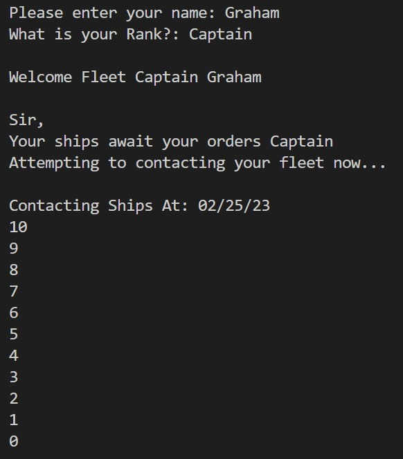
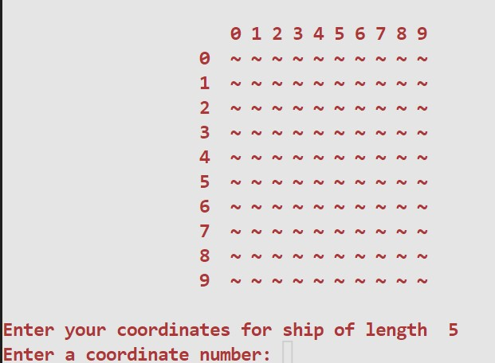
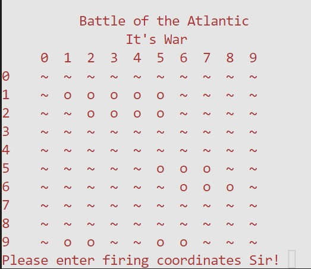
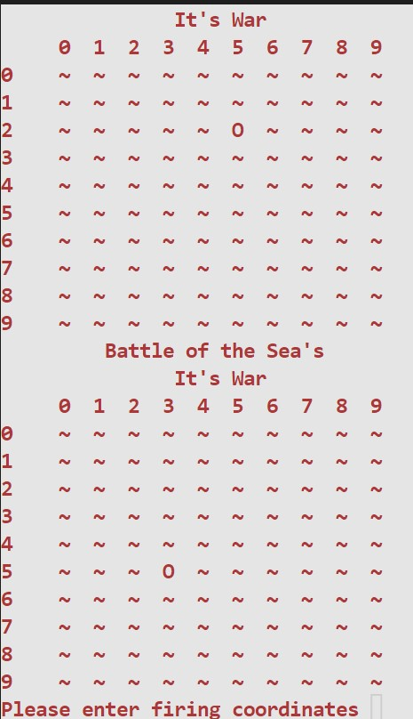
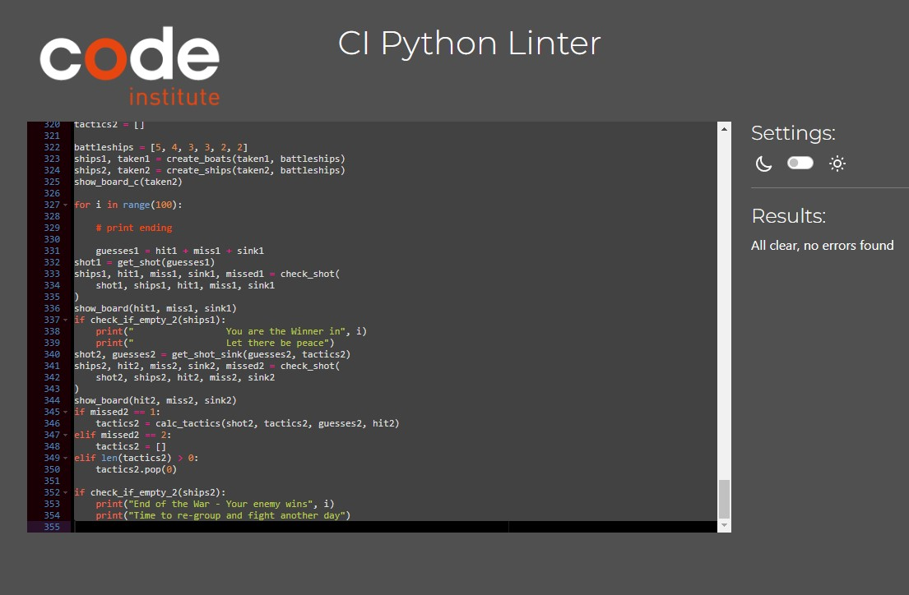
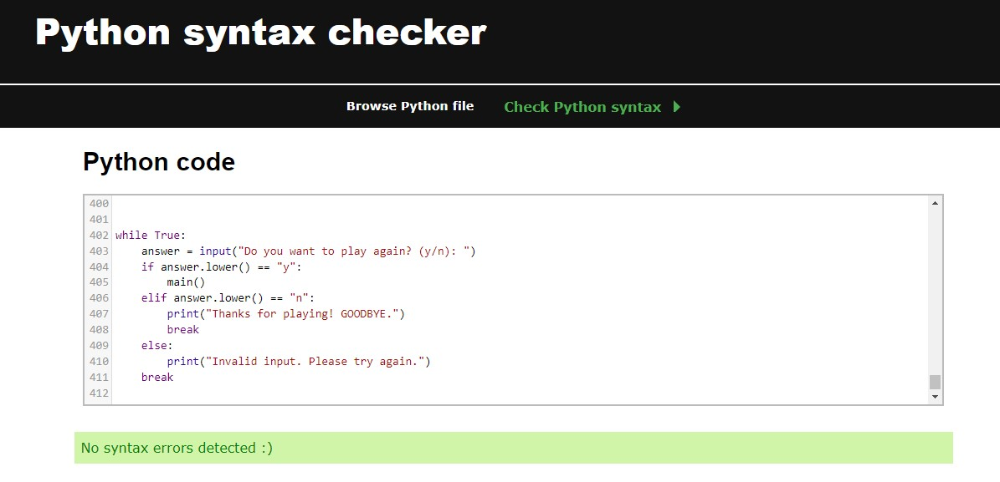

# Welcome to my Project 3 README page

<ul class="navlist">
                <li><a href="#my project 3">My Project 3</a></li>
                <li><a href="#design">Design</a></li>
                <ul>
                    <li><a href="#starting-point">Starting Point</a></li>
                    <li><a href="#how-to-play">How to Play</a></li>
                    <li><a href="#your-ships">Your Ships</a></li>
                    <li><a href="#firing">Firing</a></li>
                </ul>
                <li><a href="#location">Location</a></li>
                <li><a href="#testing">Testing</a></li>
                <ul>
                    <li><a href="#bugs">Bugs</a></li>
                </ul>
                <li><a href="#deployment">Deployment</a></li>
                <li><a href="#course">Course</a></li>
                <li><a href="#books">Books</a></li>
                <li><a href="#influences">Influences</a></li>
                <li><a href="#acknowledgement">Acknowledgement</a></li>
            </ul>

# My Project 3 - Battleship Game

Hi! My name is Graham. In this README page were you will find out a little about me, my website, my coding journey, my projects and who has influenced me in the development of this website.

This is my third course project, by now I have gained a little more experience but still very much a novice. Of the options for this project I thought a Battleship would be fun with the challenging as this is one of my favourite games.

I hope you have fun.

# Design.

My design for this battleship game in Python is a very basic game, it follows the traditional rules and layout. I went for a numbers layout both horizontal and vertical as I found it a easy and simple of game operation based on the idea of naval coordinates. 

# Starting-Point
The start of the game the players name is requested then the player is welcomed to the game and given the rank of Fleet Commander and that there ships await orders, then a countdown starts, adding some animation to contact the ships.

# How-to-Play
At this point the declaration of war is made, below that the player will see a grid map of the game. The player is requested to get there navy ready for battle by requesting the coordinates for the ships. Each player has 6 ships in different length, firstly the player is asked for the coordinates for ship of length 5 meaning thats the size of that ship, after the player enters these coordinates the player will be requested the coordinates of the next ship until all 6 ships have there coordinates set.

# Your-Ships:
After you enter the coordinates for all the ships, the player will be show a grid map of there ships indicated with the letter (o). And now the game begins. The player is now asked for there first firing coordinates.

# Firing:
From now, both the player and computer will takes turns firing at the others board until all one player hits all the others ships.

The top grid is the players and the bottom is the computers, you can see that the player entered the coordinate 25, which was a miss and is now marked with an (o). if it was a hit it will be marked (X).

# Location

All my projects are also available to view on my portfolio website.
[www.dazl.ie](https://quiz.dazl.ie)

# Testing
Code continuously tested my throught the process.
<ul>
<li>Each function tested to ensure viability.</li>
<li>Pep8 in Gitpod use.</li>
<li>Python linter/Syntax checker results below</li>
<li>I have played the game several times to check its useability.</li>
</ul>

# Bugs

As each bit of code was tested throughout, any bugs found were corrected.
To ensure this tasks efficiency, the functionality of the code was check regularly.

There is an end of game error that I couldnt fix, I reached out on Slack but got no reply/help.
This error wont reset the game fully, slack link to question below:
## Slack link [Link](https://code-institute-room.slack.com/archives/C0440SHSV37/p1677620016678219)

# Deployment

### The site was deployed to Github. The step are as follows:
<ol>
<li>In the Github repository, go to setting.</li>
<li>In settings go to the pages tab, located on the left.</li>
<li>Under source, select the branch to master and click save.</li>
<li>When the master branch has been selected, the page will refresh ti indicate the successful deployment.</li>
<li>Create a Heroku app.</li>
<li>Set buildpacks to Python and Nodejs in that order.</li>
<li>Click on deploy.</li>
</ol>

### Live Github link - [Link](https://grahamwilliamson234.github.io/battleship/)
### Herokuapp link - [Link](https://battleship2023.herokuapp.com/)

# Course

## Professional Diploma in Full Stack Software Development
### University College Dublin [Website](https://www.ucd.ie/professionalacademy/why-ucd-professional-academy/)

### Code Institute [Website](https://codeinstitute.net/ie/full-stack-software-development-diploma/?utm_term=code%20institute&utm_campaign=CI+-+IRL+-+Search+-+Brand&utm_source=adwords&utm_medium=ppc&hsa_acc=8983321581&hsa_cam=14304747355&hsa_grp=128775288169&hsa_ad=595155717776&hsa_src=g&hsa_tgt=kwd-342001843376&hsa_kw=code%20institute&hsa_mt=p&hsa_net=adwords&hsa_ver=3&gclid=Cj0KCQjwnvOaBhDTARIsAJf8eVOdV0BAxB5DwdTrFB9AvR5tJ73tLtvCsSeHDsSSq9e1gNbiXiNLTZQaAkyKEALw_wcB)

 

# Influences & Credit

### Mike Dane [Website](https://www.mikedane.com/) [YouTube](https://www.youtube.com/c/GiraffeAcademy)

### W3 School [Website](https://www.w3schools.com/js/default.asp)

### Github [Website](https://github.com/)

### Slack [Website](https://slack.com/intl/en-ie/)

# Acknowledgement

I hope I have achieved my objective on this project and created a game of my own work and design but I cant be 100% certain as I have watched several tutorials on youtube and read a lot of articles online for which I may have taken an idea or two. To ensure proper credit is given to all, I have listed the youtube channels I followed for this project below:

### Dr Codie [Youtube](https://www.youtube.com/@DrCodie)
### Code Academy [Youtube](https://www.youtube.com/playlist?list=PLHdCowjFIBmI1UV60W1TVa7l91Psnw73E)
### Tech With Tim [Youtube](https://www.youtube.com/@TechWithTim)
### CHOOBYORIALS [Youtube](https://www.youtube.com/@choobtorials)

# Books

### Mike McGrath - Python - in easy steps.(2nd Edition) [Amazon](https://www.amazon.co.uk/Python-easy-steps-2nd-covers/dp/1840788127/ref=sr_1_1?crid=24VVKP8D8CQ5O&keywords=python+in+easy+steps&qid=1674419027&s=books&sprefix=python+in+easy+staeps%2Cstripbooks%2C64&sr=1-1)
